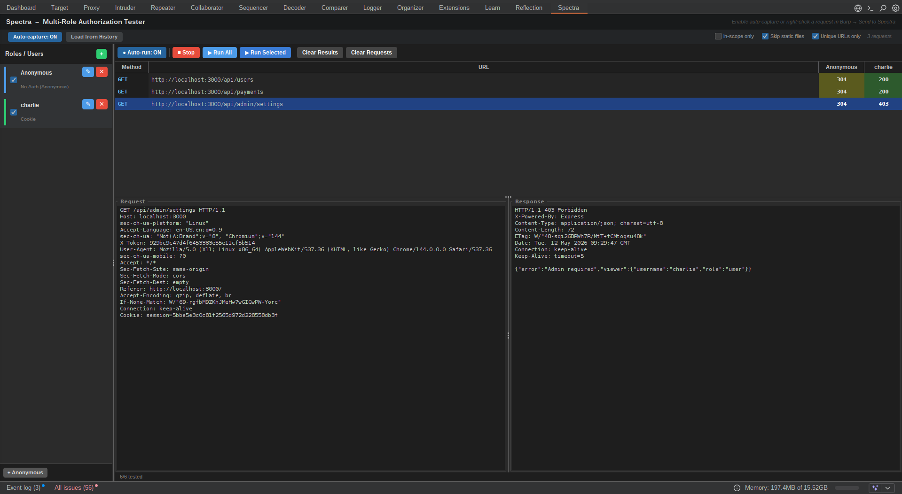

# Spectra

A Burp Suite extension for testing authorization across multiple user roles. Spectra replays captured requests under different identities, authenticated users, lower-privileged roles, and anonymous access, and presents the results in a live matrix so you can spot access-control bypasses at a glance.

---



---

## Features

- **Multi-role matrix** — compare HTTP status codes for any number of roles side by side
- **Auto-capture** — passively collects requests from the Proxy as you browse; toggle on/off at any time
- **Load from History** — import existing Proxy history in one click with scope and static-file filters
- **Anonymous user** — pre-seeded no-auth identity; strips all `Authorization` and `Cookie` headers
- **Auto-run** — tests are fired automatically as new requests or users are added (700 ms debounce); pause with the toggle and run manually when needed
- **Bypass detection** — right-click any cell to mark it as *Expected: Allow* or *Expected: Deny*; cells turn bright red when a denied endpoint returns 200
- **Per-user request/response viewer** — clicking a cell shows the exact modified request that was sent and the response received for that identity
- **Fetch from last request** — one-click extraction of `Authorization` or `Cookie` from the most recent Proxy request when adding a new user
- **Toggle column visibility** — hide any role column to focus on specific comparisons without removing the user
- **Single vs. multiple capture** — deduplicate by method + URL (default) or capture every occurrence

---

## Installation

**Pre-built JAR**

1. Download `spectra.jar` from [Releases](../../releases)
2. In Burp Suite: **Extender → Extensions → Add**
3. Extension type: **Java**
4. Select `spectra.jar` → Next

**Build from source** — see [Building](#building)

---

## Usage

### 1. Add users

The **Anonymous** user (no auth) is created automatically. Open the *Roles / Users* panel on the left and click **+** to add more:

| Auth type | What to paste |
|---|---|
| Authorization Header | `Bearer eyJhbG...` or the full header `Authorization: Bearer ...` |
| Cookie | `session=abc123; role=admin` |
| No Auth | Strips all auth headers — use for anonymous access testing |

Click **Fetch from last request** in the dialog to auto-fill credentials from the most recent Proxy request.

### 2. Capture requests

| Method | How |
|---|---|
| Auto-capture | Toggle **Auto-capture: ON** in the capture bar — new Proxy requests are added as you browse |
| Load history | Click **Load from History** to import matching requests from the current Proxy session |
| Manual | Right-click any request in Burp → **Send to Spectra** |

Filters: **In-scope only**, **Skip static files**, **Unique URLs only** (deduplicate).

### 3. Read the results

Results populate automatically. Each cell shows the HTTP status code returned for that role.

| Color | Meaning |
|---|---|
| Dark green | 2xx — allowed |
| Dark red | 4xx/5xx — denied |
| Bright red | **BYPASSED** — endpoint marked *Expected: Deny* returned 200 |
| Dark blue | Running |

Right-click a cell to set the expected result or re-run a single cell. Click a cell to view the exact request and response for that role in the panel below.

### 4. Toolbar reference

| Control | Action |
|---|---|
| **● Auto-run: ON/OFF** | Automatically test new/untested cells as requests and users change |
| **▶ Run All** | Reset all results and re-run everything |
| **▶ Run Selected** | Reset and re-run highlighted rows only |
| **■ Stop** | Cancel the active run and the pending auto-run timer |
| **Clear Results** | Reset cell states without removing requests or users |
| **Clear Requests** | Remove all captured requests |

---

## Building

Requirements: **Java 11+**, Burp Suite installed (the bundled JRE includes `javac`).

```bash
git clone https://github.com/wizoutsugar/spectra-burp
cd spectra-burp

# Copy or symlink your Burp Suite JAR into libs/
cp /path/to/burpsuite_pro.jar libs/

make          # produces spectra.jar
make install  # copies to ~/.BurpSuite/extensions/
```

The Makefile uses Burp's bundled `javac` at `~/BurpSuitePro/jre/bin/javac`. Edit the `JAVAC` variable if your installation path differs.

---

## Project structure

```
src/burp/
├── BurpExtender.java          # Entry point — ITab, IContextMenuFactory, IProxyListener
├── AuthMatrixModel.java       # Data model — users, requests, result cells
├── AuthMatrixPanel.java       # Main panel — header, capture bar, split layout
├── UserListPanel.java         # Left panel — user management
├── ResultsPanel.java          # Right panel — matrix table, detail viewer, toolbar
├── UserEditDialog.java        # Add/edit user dialog with credential fetch
├── RequestReplayWorker.java   # SwingWorker — replays requests with modified auth
├── UserEntry.java             # User model (name, auth type, value, visibility)
├── RequestEntry.java          # Request model (service, raw bytes, display URL)
└── ResultCell.java            # Cell model (status, expected result, response bytes)
```

---

## License

MIT
